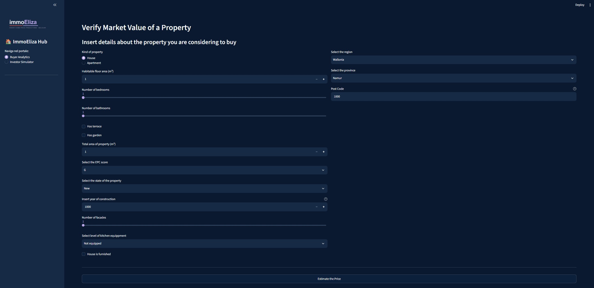
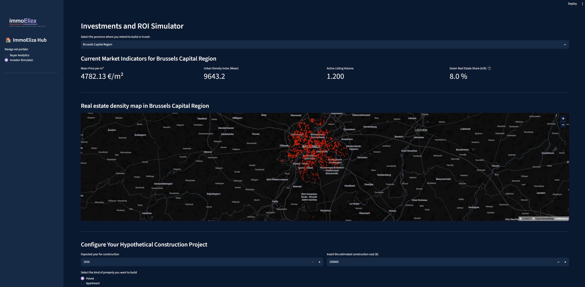

# ImmoEliza Analytics: Real Estate Valuation & Investment Portal

[](https://www.python.org/)
[](https://streamlit.io/)
[](https://fastapi.tiangolo.com/)
[](https://xgboost.readthedocs.io/)
[]()
[](https://becode.org/)

**Check the app here:** [](https://immoeliza-prediction-app.streamlit.app/)

ImmoEliza Analytics is an interactive web portal designed to deliver automated property market valuations and investment metrics across Belgium. The application couples a Streamlit visualization layer with a hosted FastAPI backend powered by an XGBoost machine learning model.

* **Domain:** Real Estate Market Intelligence & Predictive Analytics
* **Execution Timeframe:** 5-Day Sprint (Learning Challenge)
* **Development Type:** Solo Project (BeCode AI & Data Science Bootcamp)

---

## Architecture & Data Flow

```text
+-----------------------------------+       HTTP POST       +-----------------------------------+
|         Streamlit Frontend        | --------------------> |          FastAPI Backend          |
|  - UI Routing (Buyer / Investor)  |                       |  - Pydantic Request Validation    |
|  - Cached Spatial Data (CSV)      | <-------------------- |  - Preprocessing & Scalers        |
|  - Custom CSS & Plotting Engine   |     JSON Valuation    |  - XGBoost Inference Pipeline     |
+-----------------------------------+                       +-----------------------------------+
```

---

## Ingestion & System Workflow

1. **User Request**: The user enters property parameters via the Streamlit frontend UI.
2. **Data Validation**: Inputs are bundled into a JSON payload and sent via HTTP POST to the `/predict` API endpoint, validated by Pydantic schemas.
3. **Pipeline Transformation**: The backend applies serialized encoders (One-Hot, Ordinal), scaling arrays, and median fallbacks to prepare the vector.
4. **Model Inference**: The transformed feature vector is scored by an XGBoost regression model to compute predicted property valuation.
5. **UI Rendering**: The response is processed by Streamlit to render real-time valuation metrics, ROI projections, or regional market heatmaps.

---

## Core Features & Interfaces

The application isolates functional workflows based on user needs:

### 1. Home Buyer Valuation Module
* **Automated Price Estimation**: Accepts key structural inputs (living area, room count, building condition, location) to output a fair market baseline valuation.
* **Negotiation Context**: Reduces pricing asymmetry for buyers through data-backed property benchmarks.

### 2. Investor Analytics Engine
* **Financial Feasibility**: Computes projected resale revenues, net profit margins, and ROI percentages based on user-defined acquisition and renovation estimates.
* **Geospatial Insights**: Uses localized province statistics and coordinate datasets to render geographical heatmaps and regional price distributions.

---

## Data Pipeline & Backend Architecture

The backend implementation relies on modularized feature transformations prior to scoring:

```text
Input Features ---> Validation ---> Categorical Encoding ---> Numerical Scaling ---> Model Scoring ---> Output JSON
                    (Pydantic)      (OHE & Ordinal)           (Scaler)               (XGBoost)
```

* **Categorical Handling**: Uses `ohe.joblib` and `ordinal.joblib` to process structural states and categorical variables.
* **Geographic Feature Engineering**: Maps postal codes to spatial density metrics (`density_mapping.joblib`, `geo_mapping.joblib`).
* **Performance Optimization**: Implements Streamlit data caching (`@st.cache_data`) for static CSV loading (`province_stats_for_inv_app.csv`, `map_for_inv_app.csv`) to minimize interface latency.

---

## 📁 Repository Structure

```text
immo-eliza-deployment/
├── api/                                 # FastAPI Backend Service
│   ├── utils/                           # Data pipeline & transformation utilities
│   │   ├── preprocessing.py             # Feature cleaning & encoding pipelines
│   │   ├── split_data.py               # Data partitioning utilities
│   │   └── validation.py                # Pydantic data contract schemas
│   ├── app.py                           # Core API server entrypoint
│   ├── predict.py                       # ML model execution routing
│   ├── Dockerfile                       # Container definition for API deployment
│   └── *.joblib                         # Serialized pipeline encoders, scalers & model
├── streamlit/                           # Streamlit Frontend Application
│   ├── .streamlit/
│   │   └── config.toml                  # UI theme parameters
│   ├── map_for_inv_app.csv              # Coordinate data for geospatial visualization
│   ├── province_stats_for_inv_app.csv   # Aggregated regional baseline statistics
│   └── streamlit_app.py                 # Application layout & UI engine
├── README.md                            # Project documentation
└── requirements.txt                     # Explicit Python dependencies list
```

---

## Local Setup & Deployment

### 1. Clone Repository

```bash
git clone [https://github.com/ireneghioni-glitch/immo-eliza-deployment.git](https://github.com/ireneghioni-glitch/immo-eliza-deployment.git)
cd immo-eliza-deployment
```

### 2. Launch FastAPI Backend

```bash
# Install dependencies
pip install -r requirements.txt

# Start the API server
uvicorn api.app:app --reload --port 8000
```

### 3. Launch Streamlit Frontend

In a separate terminal window:

```bash
streamlit run streamlit/streamlit_app.py
```

---

## Application Previews

### Buyer Interface



### Investor Interface



<br>

---

<br>

### Author

**Irene Ghioni**  
[AI & Data Science](https://becode.org/en/job-seekers/trainings/ai-data-science) Trainee at [BeCode Belgium](https://becode.org/) *(Specializing in Data Science)*  

[](https://www.linkedin.com/in/ireneghioni/) [](https://github.com/ireneghioni-glitch)